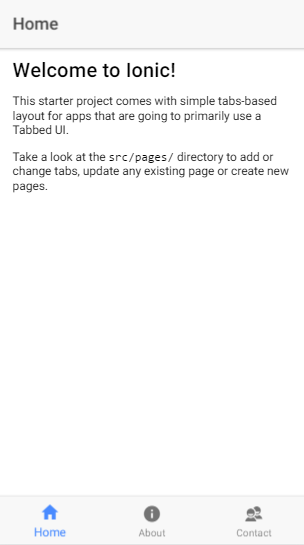

# Sesión 2

1. Estructura de un proyecto [Ionic 2](https://ionicframework.com)
    - Estructura de directorios.
        - `node_modules`
        - `hooks`
        - `plugins`
        - `resources`
        - `src`
        - `www`
        - `*`
    - Funcionamiento de ficheros:
        - `.editorconfig`
        - `.gitignore`
        - `.config.xml`
        - `ionic.config.json`
        - `package.json`
        - `tsconfig.json`
        - `tslint.json`
    - Decoradores
    - Clases
    - Tipos de datos
    - Providers o Servicios.
        - Inyección
2. Conocer el funcionamiento de los decoradores de [Angular v2](https://angular.io).
3. Interactuar con el modo desarrollo. Comando `ionic serve`
4. Binding de objetos entre *componente* y *template*.

## Vista previa

