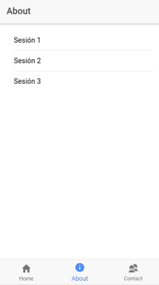
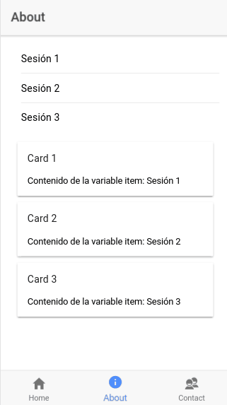

# **Sesión 3**

> Recomendado: Leer [documentacion aquì](https://github.com/juliandavidmr/TallerAppsIonic/tree/master/docs).

1. **Ionic CLI**
    - Crear proyecto: `ionic start MyApp --v2`.
    - Correr servidor de desarrollo: `ionic serve`.
3. **UI (Interfaz de Usuario)**
    - UI para listado.
    - UI para Cards.
3. **Bindings & Directivas**
    - `ngFor`
    - `ngIf`
    - `click`
    - `ngModel`
2. **Repaso Typescript.**

# **Conceptos**
<center>

</center>


# **Desarrollo**

- ### **Listar:** Mostrar listado de elementos

Objeto tipo vector de cadenas con tres elementos. La variable `listado` se
crea dentro del componente de la pagina, p.ej: `about.ts`. [Ver más](https://github.com/juliandavidmr/TallerAppsIonic/blob/276041c7d2f908da716f405383e800eab22f9b6c/src/pages/about/about.ts#L10).
```typescript
listado = ['Sesión 1', 'Sesión 2', 'Sesión 3']
```

El siguiente segmento de código se agrega dentro de las etiquetas `<ion-content>`. [Ver más](https://github.com/juliandavidmr/TallerAppsIonic/blob/276041c7d2f908da716f405383e800eab22f9b6c/src/pages/about/about.html#L11).
```html
<ion-list>
  <button ion-item *ngFor="let item of listado">
    {{ item }}
  </button>  
</ion-list>
```
_No olvidar colocar `*` antes del ngFor, `*ngFor`._

Resultado
<center>
  
</center>

----

- ### **Cards: Tarjetas** #

Mostrar listado de Cards. Incluye la captura de la variable de indexado `index`
```html
<ion-card *ngFor="let item of listado; let i = index">
  <ion-card-header>
    Card {{ i + 1 }}
  </ion-card-header>
  <ion-card-content>
    Contenido de la variable item: {{ item }}
  </ion-card-content>
</ion-card>
```

Resultado
<center>
  
</center>


----

- ### **Condiciones**

Angular 2 ofrece la directiva `*ngIf` para establecer condiciones.
`*ngIf`: si la condición se cumple, su elemento se inserta en el DOM, en caso contrario, se elimina del DOM. (equivale al `ng-if` de AngularJS v1 y `v-if` de VueJS)

```html
<label *ngIf="i > 1">El index es mayor que 1</label>
```
Donde `i` es una variable generada por el `ngFor`. Ver ejemplo de listar Cards. [Ver más](https://github.com/juliandavidmr/TallerAppsIonic/blob/4d40320d8e55b1279e8964c0386f12fb7814f4a5/src/pages/about/about.html#L23)

----

- ### **ngModel**: Pasar objetos de template a component y viceversa.

En el componente, se agregan los atributos a usar. 
En este caso se usan dos variables de tipo `string` para el intercambio de datos entre _template_ y _component_. [Ver màs](https://github.com/juliandavidmr/TallerAppsIonic/blob/4c985d2c177072ddd7b329240fb8cebd31babbce/src/pages/home/home.ts#L11)
```ts
email: string = ''
passw: string = ''
```
Posteriormente se usa la directiva de Angular 2, `[(ngModel)]`, para la especificaciòn de los objetos que han sido creados en el componente. [Ver màs](https://github.com/juliandavidmr/TallerAppsIonic/blob/4c985d2c177072ddd7b329240fb8cebd31babbce/src/pages/home/home.html#L14)

```html
<ion-input type="email" placeholder="Entrada de correo" [(ngModel)]="email"></ion-input>
```

Una vez terminado lo anterior, se procede a verificar el `binding` mediante la visualizaciòn de los datos al instante en que se escribe el siguiente segmento de codigo:
[Ver màs]()
```html
<ion-item>
  {{ email }} & {{ passw }}
</ion-item>
```
_**Nota:** Recordar que `{{ xyz }}` es la sintaxis para llamar elementos directamente desde el componente, donde `xyz` es el nombre del objeto y `{{ }}` es la manera en que Angular2 realiza esta funciòn. El simbolo `&` es solo decoraciòn, no corresponde a ninguna funciòn de Angular u Ionic._

----

- ### **Eventos: _Click_**

> Se requiere hacer la funciòn de eliminar elementos de una lista cuando se presiona click a un item de la misma _(se elimina el item seleccionado)_

Tenemos el siguiente segmento de còdigo que se muestra una lista de elementos existentes en el objeto `lista` _(Ubicado en el home.ts)_ [Ver màs](https://github.com/juliandavidmr/TallerAppsIonic/blob/4c985d2c177072ddd7b329240fb8cebd31babbce/src/pages/home/home.html#L26)
```html
<!-- home.html -->

<ion-list>
  <ion-item *ngFor="let item of lista; let i = index">
    {{ item }}
  </ion-item>
</ion-list>
```

Usar la directiva `(click)` propia de Angular. Ejecuta una funcion determinada cada vez que un elemento detecta el evento de click sobre si mismo.

```html
<!-- home.html -->

<ion-list>
  <ion-item *ngFor="let item of lista; let i = index" (click)="remove(i)">
    {{ item }}
  </ion-item>
</ion-list>
```
Notar que se añadiò la funcion `remove` junto con la directiva `(click)`. Cuando la funciòn se ejecuta, se le envia el paràmetro `i` que corresponde al indice o `index` creado por la anterior directiva, `*ngFor`.

La funciòn `remove(i)` ejecuta:

```ts
// Home.ts

remove(i: number) {
  this.lista = this.lista.filter((val, index) => i !== index)
}
```
Donde se hace un filtrado de elementos mediante la funciòn `filter`. Filter es un metodo propio de las listas en javascript. [Ver màs](https://github.com/juliandavidmr/TallerAppsIonic/blob/4c985d2c177072ddd7b329240fb8cebd31babbce/src/pages/home/home.ts#L22)

### Mas información

- [Documentación completa de `ngFor`](https://angular.io/docs/ts/latest/guide/template-syntax.html#!#ngFor)
- [Binding Angular 2](https://blog.thoughtram.io/angular/2016/10/13/two-way-data-binding-in-angular-2.html)
- [Tutorial completo de directivas](http://blog.enriqueoriol.com/2016/07/introduccion-angular-2-parte-ii-binding-directivas.html)
- [Documentación Ionic 2: List](http://ionicframework.com/docs/components/#lists)